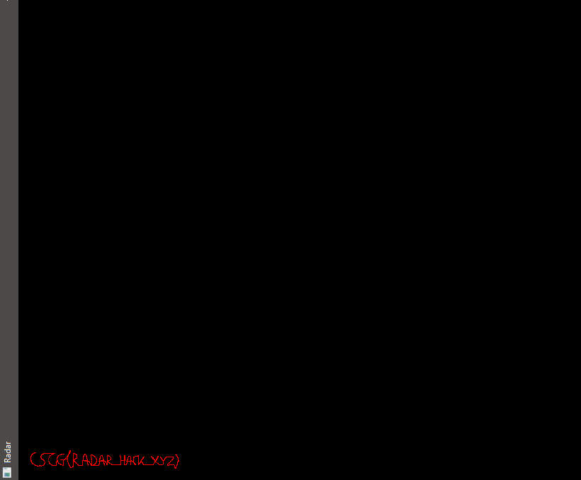

# Preamble
## Reversing
The following section will be copied to all Maze Challenges as it is the base for all my exploits. All the Exploits are written for Maze version 2.

To solve the challenge I wanted to reverse engineer the game. Upon opening the game folder I saw a folder called `il2cpp_data`. After a bit of googling I found that there is a [
Il2CppDumper](https://github.com/Perfare/Il2CppDumper) which would give me all the symbols which can be imported into ghidra or IDA. Now I could understand the decompiled or even the disassembled code much easier.

## Exploit Base
For the exploit base I followed the external game hacking tutorial from [guidedhacking](https://guidedhacking.com/threads/start-here-beginners-guide-to-learning-game-hacking.5911/). There a `proc.cpp` file is created to help working with processes, modules and pointers.
```cpp
#include "stdafx.h"
#include "proc.h"
//https://guidedhacking.com

DWORD GetProcId(const wchar_t* procName)
{
	DWORD procId = 0;
	HANDLE hSnap = CreateToolhelp32Snapshot(TH32CS_SNAPPROCESS, 0);
	if (hSnap != INVALID_HANDLE_VALUE)
	{
		PROCESSENTRY32 procEntry;
		procEntry.dwSize = sizeof(procEntry);

		if (Process32First(hSnap, &procEntry))
		{
			do
			{
				if (!_wcsicmp(procEntry.szExeFile, procName))
				{
					procId = procEntry.th32ProcessID;
					break;
				}
			} while (Process32Next(hSnap, &procEntry));

		}
	}
	CloseHandle(hSnap);
	return procId;
}

uintptr_t GetModuleBaseAddress(DWORD procId, const wchar_t* modName)
{
	uintptr_t modBaseAddr = 0;
	HANDLE hSnap = CreateToolhelp32Snapshot(TH32CS_SNAPMODULE | TH32CS_SNAPMODULE32, procId);
	if (hSnap != INVALID_HANDLE_VALUE)
	{
		MODULEENTRY32 modEntry;
		modEntry.dwSize = sizeof(modEntry);
		if (Module32First(hSnap, &modEntry))
		{
			do
			{
				if (!_wcsicmp(modEntry.szModule, modName))
				{
					modBaseAddr = (uintptr_t)modEntry.modBaseAddr;
					break;
				}
			} while (Module32Next(hSnap, &modEntry));
		}
	}
	CloseHandle(hSnap);
	return modBaseAddr;
}

uintptr_t FindDMAAddy(HANDLE hProc, uintptr_t ptr, std::vector<unsigned int> offsets)
{
	uintptr_t addr = ptr;
	for (unsigned int i = 0; i < offsets.size(); ++i)
	{
		ReadProcessMemory(hProc, (BYTE*)addr, &addr, sizeof(addr), 0);
		addr += offsets[i];
	}
	return addr;
}
```
Then there is a `mem.cpp` file explained which helps writing instructions to the memory.
```cpp
#include "stdafx.h"
#include "mem.h"
//https://guidedhacking.com

void mem::PatchEx(BYTE* dst, BYTE* src, unsigned int size, HANDLE hProcess)
{
	DWORD oldprotect;
	VirtualProtectEx(hProcess, dst, size, PAGE_EXECUTE_READWRITE, &oldprotect);
	WriteProcessMemory(hProcess, dst, src, size, nullptr);
	VirtualProtectEx(hProcess, dst, size, oldprotect, &oldprotect);
}

void mem::NopEx(BYTE* dst, unsigned int size, HANDLE hProcess)
{
	BYTE* nopArray = new BYTE[size];
	memset(nopArray, 0x90, size);

	PatchEx(dst, nopArray, size, hProcess);
	delete[] nopArray;
}
```
With the help of these methods I could now initialize my exploit. First I open the right process and then get the base address of the moudles I need. After that I resolved the needed addresses and pointer chains. In the end there is a loop which reads and writes to the memory.
```cpp
int main()
{
	//Get ProcId of the target process
	DWORD procId = GetProcId(L"Maze.exe");

	if (procId)
	{
		//Get Handle to Process
		hProcess = OpenProcess(PROCESS_ALL_ACCESS, NULL, procId);

		gameAssemblyModuleBase = GetModuleBaseAddress(procId, L"GameAssembly.dll");
		unityPlayerModuleBase = GetModuleBaseAddress(procId, L"UnityPlayer.dll");

		//Resolve address
		...

		//Resolve base address of the pointer chain
		...
	}
	else
	{
		std::cout << "Process not found, press enter to exit" << std::endl;
		getchar();
		return 0;
	}

	std::cout << "Curent gameAssemblyModuleBase = 0x" << std::hex << gameAssemblyModuleBase << std::endl;
	std::cout << "Curent unityPlayerModuleBase = 0x" << std::hex << entityObjectAddr + posOffset << std::endl;

	DWORD dwExit = 0;
	while (GetExitCodeProcess(hProcess, &dwExit) && dwExit == STILL_ACTIVE)
	{
		updateValues();
		//printValues();

		checkKeys();
        changeEmoji();
	}

	std::cout << "Process not found, press enter to exit\n";
	getchar();
	return 0;
}
```

# First thoughts:
The challenge is to map a players position.

# The Exploit:
The players postion memory address can be found via IDA and CheatEngine. I didn't bother to search for a pointer so I just used the memory address as is.

After I got the postion memory address I could plot it via SDL.

First I had to initialize the window
```cpp
void sdl_Init() {
	SDL_Init(SDL_INIT_VIDEO);
	SDL_Window* window = SDL_CreateWindow("Radar", SDL_WINDOWPOS_CENTERED, SDL_WINDOWPOS_CENTERED, 800, 800, SDL_WINDOW_SHOWN);
	renderer = SDL_CreateRenderer(window, -1, 0);

	SDL_SetRenderDrawColor(renderer, 0, 0, 0, 255);
	SDL_RenderClear(renderer);
	SDL_RenderPresent(renderer);
}
```

After which I could draw a pixel for every position on the screen
```cpp
void sdl_Draw() {
	float xBot = 0, zBot = 0;
	ReadProcessMemory(hProcess, (BYTE*)(0x13321668D2c), &xBot, sizeof(xBot), nullptr);
	ReadProcessMemory(hProcess, (BYTE*)(0x13321668D24), &zBot, sizeof(zBot), nullptr);
	SDL_SetRenderDrawColor(renderer, 255, 0, 0, 255);
	SDL_RenderDrawPoint(renderer, xBot, zBot);
	SDL_RenderPresent(renderer);
}
```

That resulted in  which got me the flag.

# Prevention:
The problem here is that the other players coordinates are send from everywhere on the map. The player should only get the coordinates from the other players around him.
