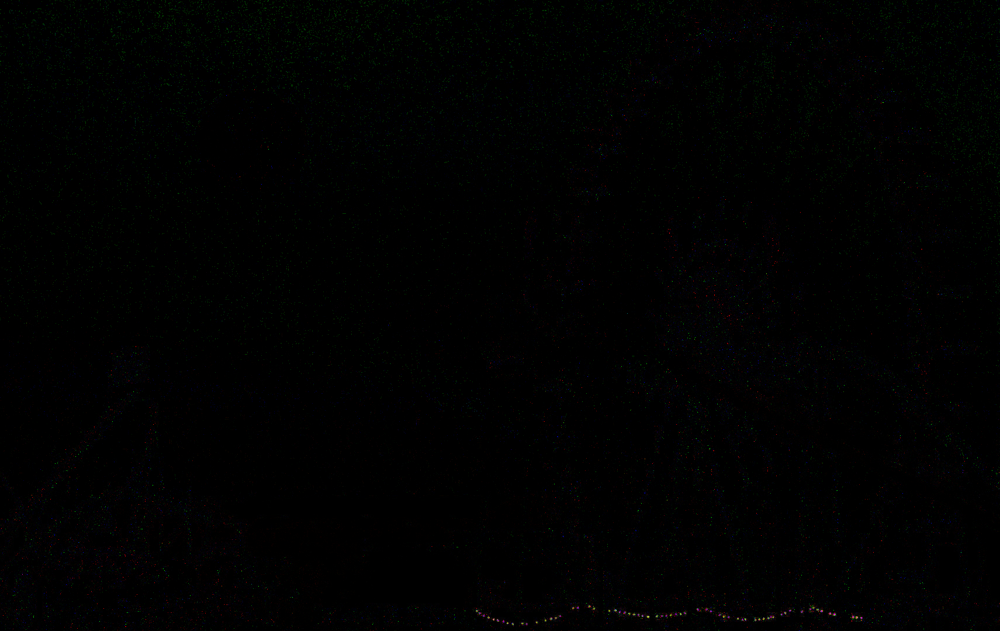

# Solve
## Stage 1
In the challenge I got an archive which contains a file called `matrix.wav`. After some time I tried looking at it in `Audacity` and opend the spectogram. I noticed there are some letters written. So I fumbled around a bit with the settings and got the best result by setting the max frequency to 20000 and the window type to Hann. Now I could read `The password is: Th3-R3D-P1ll?` but I had to dinf out where I coud use it.
I tried steghide and could extract an image called `redpill.jpg` with the command `steghide extract -sf matrix.wav -p Th3-R3D-P1ll?`.

## Stage 2
After doing a Google reverse image search I found out the original photo is from [here](https://www.fotocommunity.de/photo/oktoberfest-bei-nacht-mit-vollmond-padre-don-pedro/22544918). Now I could use the program `Stegsolve` to do an XOR of the 2 images and get . There I saw that the main diffrence are the fairy lights at the bottom right of the picutre which are colored a diffrent way. I counted the number of red and blue dots and it turned out there where 64 so I guessed that the blue ones represent a 0 and the green a 1
```
bggbgggb    ->  01101110    ->  0x6e    -> n
bbgbbbbg    ->  00100001    ->  0x21    -> !
bgbbbbgg    ->  01000011    ->  0x43    -> C
bbggbbgg    ->  00110011    ->  0x33    -> 3
bgbggggg    ->  01011111    ->  0x5f    -> _
bgbgbbbb    ->  01010000    ->  0x50    -> P
bgbgbggg    ->  01010111    ->  0x57    -> W
bbgggggg    ->  00111111    ->  0x3f    -> ?
```
That resulted in the password `n!C3_PW?`.
Now I ran `binwalk -e redpill.jpg` which found zip archive containing a secrets.txt file. I tried unzipping the file with the password and it worked.

## Stage 3
Now that I got the `secrets.txt` file I just had to find out what the encoding of the file was `6W6?BHW,#BB/FK[?VN@u2e>m8`. After a long time I figured out it was Base85 encoded.
The result was the correct flag `CSCG{St3g4n0_M4s7eR}`

# Prevention
The real problem here is that stegano is used. That is very unsafe!!!
