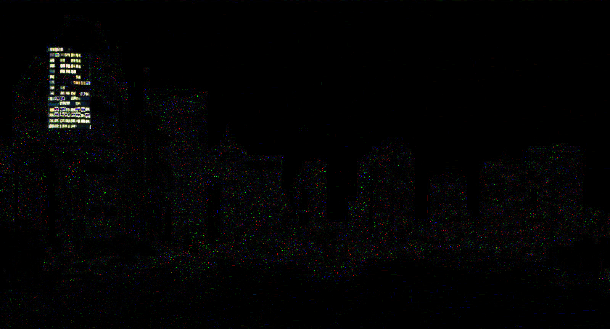

# Solve
The challenge is to get the flag from the image. After I tried many things and extracting something from the image, I tried a reverse image search. I used TinEye to get the original image which was a picture of Brisbane in the night.
I then combined both pictures and got the diffrence between them.  
Here I could see that the skyscraper on the left had its window lights modified. I thought maybe it was a binary code the lit window means a 1 and the unlit is a 0.
```
01000011    0x43
01010011    0x53
01000011    0x43
01000111    0x47
01111011    0x7b
01100001    0x61
01011111    0x5f
01000110    0x46
01101100    0x6c
00110100    0x34
01100111    0x67
01111101    0x7d
00000000    0x0
00000000    0x0
```
This was the result, which in ASCII corresponds to the flag `CSCG{a_Fl4g}`.

# Prevention
The real problem here is that stegano is used. That is very unsafe!!! But if someone really wants to do it the person shouldn't use an image where the original can be found be simple reverse image search.
