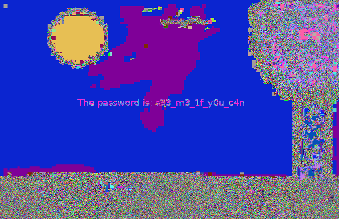

# Solve
The challenge is to get the flag from a given image. After testing some thing I ran binwalk on the image to see if the image contains some other files. With the command `binwalk -e chall.png` I could extract these files where I saw that the image contained a zip archive which contained a `flag.txt` file. This file was empty, so I tried to extract the zip archive myself with the `unzip` command which told me that the file was encrypted.
So I tried a program called `Stegsolve` which can display the image in multiple ways like only show the red color channel or map each color to a random one. There I found the password .
Now I could extract the zip archive with the password and I got the `flag.txt` file which contained the flag.

# Prevention
The real problem here is that stegano is used. That is very unsafe!!! But if someone really wants to do it the person shouldn't write the password inside the imgae. The password should be transmitted over a secure channel.
